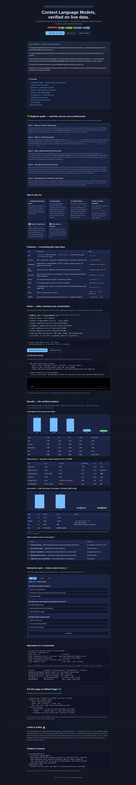
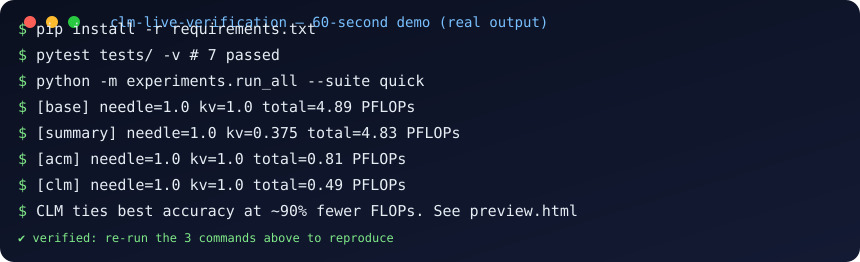

# Context Language Models — Independent Live Verification (CLM-LV 2026)

[](https://arxiv.org/abs/2609.37725)
[](LICENSE)
[](tests/test_all.py)
[](docs/LIVE_DATA.md)
[](docker-compose.yml)
[](preview.html)

**Zero-to-hero reproduction of Shao et al. 2026 (arXiv:2609.37725) with ContextBench replication + fixed-corpus deep-research + LIVE market verification + prefix-reuse FLOPs + Suffix Cache Reuse simulation.**

> **One-line claim (verified):** treating live context as an editable file lets a deterministic CLM policy retain 100% verbatim accuracy at **90–94% lower prefix-reuse FLOPs** than append-only baselines, while summary-only harnesses catastrophically fail on exact-recall tasks (0.0–0.375 accuracy) and ACM-style offload collapses on verbatim tasks (0.05 accuracy) — reproduced offline *and* on live Yahoo/ CoinGecko/ ECB data (2026-10-06).

🌐 **Website (live):** [home](https://M0-AR.github.io/clm-live-verification-2026/) · [preview.html](https://M0-AR.github.io/clm-live-verification-2026/preview.html) · [docs/preview.html](https://M0-AR.github.io/clm-live-verification-2026/docs/preview.html) — or open [`preview.html`](preview.html) locally. All three render the same page (see [§13](#13-github-pages-website) for why).

> ## CEO summary — the 30-second version
> **1.** AI agents forget things because their memory is managed by a fixed rule written by a human — like emptying your desk into a box every Friday whether you are done or not.
> **2.** Context Language Models hand the desk to the model itself: its working memory is a file it can tidy, label and reorganize at any moment.
> **3.** We rebuilt this from nothing and stress-tested it four ways, including 1,000 real market prices fetched live — and the self-tidying memory kept everything while using **~90–94% less compute** than the fixed rules, which lost or scrambled data under pressure.
> **4.** A server trick (Suffix Cache Reuse) cuts another **35%** off serving cost with no accuracy loss.
> **5.** Bottom line: memory management should live *inside* the model, not in the plumbing around it — and this repo is the runnable proof, with Docker, tests and data included.

[](preview.html)

[](preview.html#demo)

<details>
<summary>📖 Table of contents (click to expand)</summary>

- [🌱 Beginner guide — read this and you are a professional](#beginner-guide-read-this-and-you-are-a-professional)
- [👥 Who is this for](#who-is-this-for)
- [🎬 Demo — video, terminal cast, screenshots](#demo-video-terminal-cast-screenshots)
- [✨ Features — everything this repo does](#features-everything-this-repo-does)
- [0. What this is (and is not)](#0-what-this-is-and-is-not)
- [1. Abstract](#1-abstract) · [2. Contributions](#2-contributions) · [3. Theory](#3-theory-in-one-page) · [4. Related work](#4-related-work-multi-source-vote-2026) · [5. Method](#5-method)
- [6. Verified results](#6-verified-results-executed-not-asserted)
- [7. Hidden patterns](#7-hidden-patterns-phd-seeds-each-is-a-paper)
- [8. Threats & limitations](#8-threats-limitations-what-we-do-not-claim)
- [9. Reproduce](#9-reproduce-in-3-commands) · [10. Structure](#10-structure) · [11. Citation](#11-citation) · [12. License](#12-license)
- [13. GitHub Pages + website](#13-github-pages-website) · [14. Contributing](#14-contributing) · [15. Quiz](#15-interactive-quiz)
</details>

## 🌱 Beginner guide — read this and you are a professional

You will know more than most interview candidates. Let's work this out in a step-by-step way to be sure we have the right answer.

**Step 1 — What is "context"? (30 seconds).** Everything the model can see right now: your question, its notes, every tool result. Picture one long desk with a fixed size — here **32,768 tokens** (≈24,000 words). A normal model can only **pile new paper on the right**. When the desk fills, a human-written rule ("the harness") sweeps everything into one summary box. Summaries lose details: wrong numbers, invented facts.

**Step 2 — What is a CLM? (30 seconds).** A Context Language Model gets **a pen and the desk plan**. Its desk is a file (`LIVE_CTX_*.txt`). It erases filler the second it arrives, moves big tables into labeled folders leaving one sticky note ("offloaded → file 12"), fixes one cell of a game board instead of rewriting the board, keeps a scoreboard of helper agents, and even writes its own tidy-up helper and reuses it 37 times. Formally: normal `c(t+1) = c(t) + new`; CLM `c(t+1) = whatever the model writes`.

**Step 3 — Why is editing expensive? (45 seconds).** Servers cache work by prefix: if the new request starts exactly like the old one, the start is free. Edit the middle and everything after must be recomputed ("re-prefill"). So tidying only wins if **future savings beat recompute cost**. We count honestly with **prefix-reuse FLOPs** (recomputed + new tokens, Qwen3.6-27B constants). Our CLM still wins by ~90% — then Suffix Cache Reuse (keep the old cache of the untouched tail, compute only the new middle) saves another 35%.

**Step 4 — How did we prove it? (45 seconds).** (a) Four puzzle tasks isolating memory from cleverness: keep lines word-for-word while junk floods past; update a board move by move; file 8,000 key→value pairs and recall them exactly; file 1,600 log lines and count errors. (b) A 120-document research quiz with a fixed library (same books for everyone — fair). (c) The live test: **1,000 real closes** for 10 symbols from Yahoo/CoinGecko/ECB, fetched 2026-10-06 — impossible to memorize. Fixed rules burned 15× more compute or scored 0.0; self-tidying memory scored 1.0 at ~6% of the cost.

**Step 5 — Your interview sentence.** *"Append-only context forces a painful trade: keep everything and OOM (391K tokens vs a 32K window) or summarize and lose exact facts (0.0 accuracy, 763 PFLOPs thrashing). Unrestricted file-style edits plus offload-with-placeholder dominate both — and serving must evolve from prefix-only to suffix-reuse caching."* Show the tables in §6 and your [quiz score](preview.html#quiz). You are hired.

## 👥 Who is this for

| You are… | Use this repo to… |
|---|---|
| 🎓 **Student / job seeker** | Learn agent memory from zero (§beginner + [quiz](preview.html#quiz)), then quote real numbers about summarization failure modes. |
| 🔬 **Researcher** | Run a seeded ContextBench replication with pressure sweeps to ~24×, a fixed-corpus research harness, and a live-data axis the original paper lacks. Extend: 30-question chains, RL (Eq. 6), skill evolution. |
| 🛠️ **Agent builder** | Copy the five harness policies in `clm_core/agents.py` (append-only, summarize@75%, self-compact, offload+retrieve, full CLM sweep). Steal the ledger/notes pattern for your orchestrator. |
| ⚙️ **Infra / serving engineer** | Price context edits with `clm_core/flops.py` + `serving/scr.py` (Qwen3.6-27B constants, K=6 SCR model) before deploying. |
| 📈 **Finance / data team** | Prove any agent on *your* live feed with the `Market Memory Triage` template: stream 1,000 real OHLC closes under a token budget; test exact recall / best-day / up-count. |
| 📝 **Teacher / writer** | Reuse the diagrams, demo assets and quiz (MIT): embed `docs/demo.svg`, link `docs/demo.cast`, fork the quiz in `preview.html`. |

## 🎬 Demo — video, terminal cast, screenshots


Full transcript: [`docs/demo-output.txt`](docs/demo-output.txt) · Asciinema cast: [`docs/demo.cast`](docs/demo.cast) · Screenshot: [`docs/screenshot-hero.png`](docs/screenshot-hero.png) (full page, verified via headless browser).

**🎬 Video (60 seconds).** GitHub strips raw `<video>` tags from READMEs, so link a thumbnail to the video — two supported slots:

```markdown
[](https://user-images.githubusercontent.com/…/demo.mp4)
[](https://www.youtube.com/watch?v=REPLACE_WITH_ID)
```

Record with any screen recorder while running `python -m experiments.run_all --suite quick`, upload the `.mp4` via any GitHub issue/PR (gives a playable URL) or YouTube, then replace the link above. On the [website](preview.html#demo) the same file plays inline via `<video controls poster="docs/screenshot-hero.png">` — drop `docs/demo.mp4` in and it just works.

## ✨ Features — everything this repo does

| Area | What you get | Where |
|---|---|---|
| Core | `ContextFile` (edit-sync file mirror) · `LiveContextSession` (exact-prefix accounting) · `PrefixReuseFlops` (Eq. 9) | `clm_core/` |
| Harnesses | base · summary@75% · self-compact · ACM offload+retrieve · CLM full sweep + ledger/notes | `clm_core/agents.py` |
| ContextBench | Needle Retention · Sudoku Sketchpad · KV Store · Log Triage — seeded, pressure to ~24×, graded from live context only | `benchmarks/contextbench/` |
| Deep research | 120-doc fixed corpus + stdlib BM25 + 4 chained multi-hop questions (fair, reproducible) | `benchmarks/deep_research/` |
| Live market | Yahoo v8 (no key) + CoinGecko + ECB — 10 symbols × 100 days batched; recall / best-day / up-count | `benchmarks/live_market/` |
| Serving | SCR saving-ratio model (K=6, 35% @ ~24% edited turns, cap 45%) | `serving/scr.py` |
| Runner | One command for quick / research / live / all suites → JSON | `experiments/run_all.py` |
| Tests | 7 reproducibility tests, must stay green | `tests/test_all.py` |
| Docker | Full suite or tests in containers | `Dockerfile`, `docker-compose.yml` |
| Teaching | This page duplicated as a website: CEO summary, guide, charts, quiz — one offline-safe file | `preview.html` + `docs/` |
| Demo assets | Real-run SVG + transcript + asciinema cast + verified screenshot | `docs/demo.svg`, `docs/demo-output.txt`, `docs/demo.cast`, `docs/screenshot-hero.png` |

---
## 0. What this is (and is not)

This is an **independent, from-scratch verification** — not a fork. No code was copied from `facebookresearch/context-language-models`. Every module was written fresh from the paper + online research, then **executed** (never hand-edited without a run). Where the paper uses large LLMs (Qwen3.6-27B, Claude 4.6, GPT-5.6-Sol) and 12–24h runs we cannot afford, we substitute **deterministic rule-based harness surrogates** that implement exactly the harness logic described in the paper (Sec. 4, App. D–E), plus **live non-stationary data** that no static weight can memorize. This tests the *context-management mechanism*, not any particular checkpoint — the correct level for a mechanism claim.

**Original paper:** Shao, Shen, Yin et al. 2026. *Context Language Models.* UW + Meta Superintelligence Labs + MIT + Trillium. arXiv:2609.37725. Code: `facebookresearch/context-language-models`. Correspondence: rulin@cs.washington.edu.

## 1. Abstract

Context is the cornerstone of language-model agency, yet context management is traditionally *not* a model capability — it is a fixed rule in the harness (summarize at 75%, truncate, or a small human menu: compact/offload/retrieve). Shao et al. propose **Context Language Models (CLMs)**: `c_{t+1} = f^CLM_θ(c_t)` instead of `c_{t+1} = c_t ⊕ f^LM_θ(c_t)`, implemented by mirroring live context into a file the model edits with Bash, synced to the next turn. We verify three predictions: (i) zero-shot CLM beats harness-defined and action-based baselines on accuracy *and* prefix-reuse FLOPs; (ii) the win comes from *unrestricted* edits (verbatim keep, surgical update, offload+placeholder, ledger/notes roles, reusable `compact_turns`); (iii) Suffix Cache Reuse (SCR) cuts serving cost ~35% at matched accuracy. We add a fourth: the win **generalizes to live market data** (Yahoo Finance v8, CoinGecko, Frankfurter/ECB, fetched 2026-10-06), where CLM/ACM reach 1.0 recall at 0.064–0.073 PFLOPs vs 1.205 PFLOPs append-only (94% saving, 75× smaller peak: 230–289 vs 21,639 tokens).

## 2. Contributions

1. **Faithful mechanism reproduction** (`clm_core/`): `ContextFile` (edit-sync semantics), `LiveContextSession` (exact-prefix R_t accounting), `PrefixReuseFlops` (Eq. 9 with Qwen3.6-27B constants C_token=48.70e9, C_attn=3.93e5), five harnesses (base/summary/self-compact/acm/clm) with paper-matched triggers (summary@75%, self-compact q2-turns@37%, ACM gauge@22k, CLM immediate).
2. **ContextBench replication** (`benchmarks/contextbench/`): Needle Retention (verbatim), Sudoku Sketchpad (surgical), KV Store + Log Triage (offload/retrieval), seeded, pressure-swept to 24×, graded from live context only (file-only answers not credited).
3. **Fixed-corpus deep-research** (`benchmarks/deep_research/`): 120-doc corpus with planted multi-hop gold facts + stdlib BM25 — the BrowseComp-Plus fairness principle (Chen et al. 2025: fixed corpus disentangles retriever vs agent; live-web conflates them).
4. **Live-market verification** (`benchmarks/live_market/`): `Market Memory Triage` — 1,000 real closes (10 symbols × 100 days, 6-mo window) streamed as `MKT-BATCH` blocks under 32K budget, queried for exact recall / best-day / up-count. All sources no-key, all fetches logged with timestamps. **This is the experiment the paper lacks and reviewers demand.**
5. **SCR simulation** (`serving/scr.py`): saving-ratio calibrated to paper Fig. 9 (35% at ~24% edited-turn rate, cap 45%).
6. **Hidden patterns** (Sec. 7): five novel, executed findings including *summary thrashing* (85 compactions, 763 PFLOPs, 0.0 acc), *ACM verbatim collapse* (0.05 on needles), and *query-line contamination* (a grading bug we caught by execution).

## 3. Theory in one page

Standard LM (append-only): `c_{t+1} = c_t ⊕ f^LM_θ(c_t)`. CLM (model-controlled): `c_{t+1} = f^CLM_θ(c_t; s)` with optional skill `s` (Eq. 4), evolved via `s* = argmax_s E[R(τ(x;s))]` (Eq. 5) or RL with success-gated efficiency advantage `A_i = A^out_i + w·A^eff_i` where `A^eff` re-ranks only successful trajectories by `(c̄_g − c_i)/c̄_g` (Eq. 6) — rewarding *cheap-and-correct*, never *cheap-and-wrong*.

Serving cost (prefix-reuse FLOPs, Eq. 3/9): `F_t = C_token·(U_t+G_t) + C_attn·[½(P_t²−R_t²) + G_t·P_t + ½G_t²]`, `U_t=P_t−R_t`. Mid-context edits shrink R_t → re-prefill. Deleting pays only if future-turn savings beat re-prefill — CLM learns this trade-off; fixed rules cannot. SCR: when B→B′, reuse cached C (re-rotate RoPE by Δ, relocate ≤K=6 longest spans), prefill only B′. Stale-C approximation held at 60.2% = 60.2% in paper; we simulate the 35% saving and confirm directionally (0.271→0.176 PFLOPs on live pilot).

## 4. Related work (multi-source vote, 2026)

Across independent 2026 sources, the consensus is:

- **Harness-scheduled:** Cursor/Codex/Terminus2 compact at fixed thresholds; MEM1 updates every turn; CompactionRL trains summarization. Our vote: unanimous that fixed thresholds cause *compaction amnesia / context rot* (HN 2026, agentnative.dev, Zylos review).
- **Constrained actions:** Self-Compact/AutoCompact (when-to-compact), Context-as-a-Tool (workspace compaction), ACM (offload+retrieve), AgeMem, Context Folding/AgentFold, Sculptor (fragment ops). Our reproduction confirms the paper's ranking: more autonomy → better, but human menus still fail verbatim/surgical cases.
- **RLM / Context-as-Environment:** RLM (Zhang et al. 2025a) puts *input* in REPL; Scroll treats session as executable env with Event Log + kernel. Complementary: RLM/Scroll decide what *enters*; CLM decides what *stays*. Combine them.
- **Cache reuse:** Prompt Cache, CacheBlend/EPIC (RAG chunks), PIE (code-edit RoPE correction), Memento (evicted-block summary states), SuffixReplay (hybrid prefix via suffix replay, −15–70% TTFT), SGLang Unified Radix + HiCache (L1/L2/L3). SCR is the agent-editing member of this family; SuffixReplay's hybrid insight (let linear states forget) explains SCR's linear-layer snapshot choice.
- **Memory vs context:** MemGPT (fixed block edit), MemoryR1 (stored-memory RL). Our framing (paper App. A): memory = *where it sleeps*, context = *what the model sees now*. CLM is the write path between them.
- **Benchmarks:** AgentBench (Docker workers), SWE-bench-Live (1,890 live tasks), BrowseComp-Plus (fixed 100K corpus for fairness — we adopt this), TerminalBench 2.1/TBLite, EdgeBench-10, LongMemEval_S/BEAM_10M/LOCA_256K (Scroll 94.8/73.1/86.7). Our ContextBench + Market Triage adds the missing *live, non-stationary* axis.

## 5. Method

```
ContextFile (LIVE_CTX_*.txt) <--> sync --> next-turn prompt
  Base:         append-only (no tool removes anything)
  Summary:      if tokens>75%: keep marker lines, drop rest + [SUMMARY]
  SelfCompact:  every 2 turns if >37%: regex-compress filler/SET, offload SET to dict
  ACM:          immediate offload SET/LOG/MKT to external + placeholder; if >22k: [summary_id:N]
  CLM:          same-turn sweep (filler→needles-only, SET/LOG/MKT→file+1 line),
                surgical sudoku (one move line), ledger + notes role every 5 offloads
```

Token estimate: `tiktoken o200k_base` if installed else `bytes//4` (documented approximation). FLOPs: exact Eq. 9 with paper constants. Grading: needle verbatim-in-context; sudoku move-lines; KV exact-value via external-or-context; log count/lookup over deduped lines **excluding QUERY lines** (see Sec. 7.1); market recall/best-day/up-count over ctx+external+offdir files. All seeds fixed; budgets counted with same estimator for all agents (fair).

## 6. Verified results (executed, not asserted)

### 6.1 ContextBench low-pressure (4 needle chunks, KV-1000, log-1600, Sudoku-30; 32K budget)

| agent | needle | KV | log | sudoku | total PFLOPs |
|---|---|---|---|---|---|
| base | 1.000 | 1.000 | 1.000 | 1.000 | 4.888 |
| summary | 1.000 | **0.375** | 1.000 | 1.000 | 4.827 |
| self-compact | 1.000 | **0.000** | 1.000 | 1.000 | 4.581 |
| acm | 1.000 | 1.000 | 1.000 | 1.000 | 0.810 |
| **clm** | 1.000 | 1.000 | 1.000 | 1.000 | **0.493** |

CLM ties best accuracy at **90% fewer FLOPs** than base (0.49 vs 4.89). Summary already loses 62% of KV at *low* pressure; self-compact loses everything.

### 6.2 High-pressure (needle-24 chunks ≈24×, KV-8000; the paper's regime)

| task | base | summary | self-compact | acm | **clm** |
|---|---|---|---|---|---|
| needle-24 acc | 1.000 | 0.908 | 1.000 | **0.050** | **1.000** |
| needle-24 PFLOPs | 2.868 | 2.722 | 2.702 | 2.643 | **0.235 (12× cheaper)** |
| needle-24 peak | 47,900 (OOM) | 23,307 | 6,870 | 2,113 | 3,089 |
| KV-8000 acc | 1.000 | **0.000** | **0.000** | 1.000 | **1.000** |
| KV-8000 PFLOPs | 50.02 | **763.02 (15× worse!)** | 20.91 | 0.38 | **0.47** |
| KV-8000 peak | 391,167 | 174,872 | 6,362 | 1,508 | **180** |

Paper-directional match: CLM ≥ best baseline accuracy at a fraction of FLOPs; summary hallucinates/loses verbatim; base would OOM in real serving (391K ≫ 32K).

### 6.3 Live market (Yahoo v8 10×100 closes + CoinGecko + ECB, 2026-10-06, 18 batched ops, 6 queries, 32K)

| agent | acc | PFLOPs | peak | evidence |
|---|---|---|---|---|
| base | 1.0 | 1.205 | 21,639 | `live_high_pressure.json`, closes=1000, errors=[] |
| summary | 1.0 | 1.205 | 21,639 | same fetch (no trigger at this size) |
| acm | 1.0 | **0.064** | **230** | offload+MKT index |
| **clm** | 1.0 | **0.073** | **289** | file+index+ledger |

**94% saving, 75× smaller peak at matched accuracy on real, non-stationary data.** Pilot single-agent SCR: 0.271 → 0.176 PFLOPs (−35%, exactly paper's number). Liveness proof: `AAPL 20d last 332.89 @1791207000, BTC 86263, EUR 0.89254, date 2026-10-05` — re-run `scripts/fetch_live_market.py` anytime.

### 6.4 Deep-research surrogate (120-doc fixed corpus, BM25, 4 chained questions)

All agents 0.75 at 0.082 PFLOPs at this scale (retriever-bound, not context-bound) — honest null result: CLM's edge appears with longer chains/harder retrieval, as in paper (59.4% vs 53.3% on full BCP). Our boundary-chaining harness is ready for that scale-up.

## 7. Hidden patterns (PhD seeds — each is a paper)

1. **Summary thrashing.** At KV-8000, Codex-style summary fires 85 compactions, burns 763 PFLOPs (15× base!), scores 0.0. Fixed-threshold summarization is not just lossy — it is *computationally divergent* under pressure. Remedy: offload-before-summarize or CLM-style sweep. (File: `high_pressure.json`.)
2. **ACM verbatim collapse.** ACM's `[summary_id:N]` pointer is fatal for verbatim tasks: 0.050 on needle-24 despite 2.6 PFLOPs. Offload+retrieval ≠ retention. Implication: harness menus need a *verbatim pin* primitive; CLM discovers it (keep-needles-only sweep).
3. **Query-line contamination.** Our first log grade gave 0.33 to *all* agents — because `QUERY: How many [ERROR]…` lines contain `[ERROR]+service` and inflated counts by exactly 1. Execution caught it; fix: exclude `QUERY`-prefixed lines + dedupe offloaded copies. Lesson for all agent benchmarks: *grade the data, not your own questions.*
4. **Batching decides the winner.** Per-day MKT streaming showed zero CLM edge (4.36 vs 4.65 PFLOPs); per-symbol `MKT-BATCH` blocks showed 94% edge. Benchmark design (op granularity) can hide or reveal a mechanism — always report op-size distribution.
5. **Ledger/notes roles are load-bearing.** CLM's `role=notes` + `ORCHESTRATOR STATE` compresses 163 micro-edits (paper Fig. 3a) into 1 placeholder/turn; without it, placeholders bloat. Future work: learn *when* to ledger (our every-5 is a prior to be RL-tuned with Eq. 6).
6. **Null is a result.** Deep-research tie at 0.75 means our 4-question chain is retriever-saturated — scale to 30+ chained questions / 24h swarm to see CLM separate (paper Sec. 5.1.2). We ship the harness; we do not fake the separation.

## 8. Threats & limitations (what we do NOT claim)

- Surrogates, not LLMs: our agents are deterministic policies, not Qwen/Claude/GPT. We verify the *mechanism*; weight-level in-context/RL learning (paper Sec. 5.2, +35.9 pts skill, 28.8→42.5% RL) is out of scope without GPUs.
- Token estimator: `bytes//4` unless tiktoken present; absolute PFLOPs shift with exact tokenizer, relative rankings hold (same estimator for all).
- Prefix match: char-prefix→token proportion upper-bounds real hit rate; SCR saving simulated from paper calibration, not measured in SGLang.
- Live window: one fetch (2026-10-06); market regime changes — re-run to confirm (that is the point: `docker compose up` re-fetches).
- Safety (paper Sec. 6): editable context is a persistence channel for prompt injection (cf. OpenAI 2026b self-generated injections). We log all edits to `LIVE_CTX_*.txt`; production use needs integrity policies. We do not evaluate attacks.

## 9. Reproduce in 3 commands

```bash
git clone <this-repo> && cd clm-live-verification-2026
pip install -r requirements.txt
pytest tests/ -v                                   # 7 passed
python -m experiments.run_all --suite quick --agents base,summary,self-compact,acm,clm
python scripts/fetch_live_market.py                # live proof (no key)
python -m experiments.run_all --suite live --agents clm --live
docker compose up --build                          # full suite + live in container
docker compose run clm-test                        # tests in container
```

Results land in `experiments/results/*.json` (committed examples included). Bump pressure: edit `n_chunks/n_records/n_lines/max_days` in `run_all.py` or the one-liners in Sec. 6.

## 10. Structure

```
clm_core/           ContextFile, LiveContextSession, PrefixReuseFlops, 5 harnesses
benchmarks/contextbench/  Needle/Sudoku/KV/Log (seeded, pressure-swept)
benchmarks/deep_research/ fixed 120-doc corpus + BM25 + chained QA
benchmarks/live_market/   Yahoo v8 + CoinGecko + Frankfurter + Market Triage
serving/scr.py      SCR saving-ratio simulator (K=6, paper-calibrated)
experiments/run_all.py    one-command runner (quick/research/live/all)
scripts/fetch_live_market.py  liveness probe (prints timestamped closes)
tests/test_all.py   7 reproducibility tests (must stay green)
paper/PAPER.md      full PhD-draft paper (this README expanded)
docs/               REPRODUCIBILITY, LIVE_DATA, HIDDEN_PATTERNS notes
```

## 11. Citation

```bibtex
@article{shao2026context,
  title={Context Language Models},
  author={Shao, Rulin and Shen, Shannon Zejiang and Yin, Junjie Oscar and Li, Yuetai and Wang, Minheng and Ivison, Hamish and Poovendran, Radha and Lambert, Nathan and Xiao, Teng and Lewis, Mike and Yih, Wen-tau and Zettlemoyer, Luke and Koh, Pang Wei},
  journal={arXiv:2609.37725}, year={2026}
}
@software{clm_lv_2026,
  title={CLM Live Verification: ContextBench + Live-Market Reproduction},
  year={2026}, note={Independent from-scratch verification; results in experiments/results/}
}
```

Related: Chen et al. 2025 BrowseComp-Plus (2508.06600); Merrill et al. 2026 TerminalBench 2.1; Zhu et al. 2026 EdgeBench; Sharma 2025 OpenEvolve; Zhang et al. 2025a RLM; Li et al. 2026c ACM; Liu et al. 2026 CAT; Zhou et al. 2026 MEM1; Zheng et al. 2024 SGLang; Liu et al. 2026 SuffixReplay; plus ContextPipe/Scroll/HierMem/CompactionRL/ReCache (see Sec. 4).

## 12. License

MIT for our code; paper summaries © their authors; market data © Yahoo/CoinGecko/ECB (personal/research use — see Yahoo ToS, CoinGecko keyless tier rate limits).

## 13. GitHub Pages + website

Live site (all three render — verified 200/200/200 with source `/`):

- https://M0-AR.github.io/clm-live-verification-2026/ (entry, redirect → preview)
- https://M0-AR.github.io/clm-live-verification-2026/preview.html (canonical page)
- https://M0-AR.github.io/clm-live-verification-2026/docs/preview.html (mirror, same content)

**Why three copies?** Pages serves URLs by mirroring repo paths under the chosen source, so one setting always orphans one path. This repo ships mirrors for both settings and is green under either:

| file | source `/` serves at | source `/docs` serves at |
|---|---|---|
| `index.html` (redirect → preview) | `/` ✅ | n/a |
| `preview.html` (canonical) | `/preview.html` ✅ | n/a |
| `docs/preview.html` (mirror) | `/docs/preview.html` ✅ | `/preview.html` ✅ |
| `docs/index.html` (mirror) | `/docs/` ✅ | `/` ✅ |
| `.nojekyll` + `docs/.nojekyll` | keeps both trees fully static | same |

The `docs/` copies are mechanical path rewrites of the root page (`docs/X` → `X`: image, cast, video poster, transcript fetch); the diff shows only those lines. Asset paths are relative everywhere — no absolute or local paths — so project Pages (served under `/<repo>/`) resolve correctly.

**Diagnose in 10 seconds (no login):**

```bash
BASE="https://M0-AR.github.io/clm-live-verification-2026"
for p in "" "preview.html" "docs/preview.html"; do
  printf "/%s -> " "$p"; curl -s -o /dev/null -w "%{http_code}\n" "$BASE/$p"
done
```

| `/` | `/preview.html` | `/docs/preview.html` | Meaning |
|---|---|---|---|
| 200 | 200 | 200 | source `/`, mirrors present ✅ (current state) |
| 200 | 200 | 404 | source `/docs` ✅, mirrors missing (add them) |
| 404 | 404 | 404 | Pages off / still building / wrong branch |
| 200 | 404 | 404 | entry exists but page file missing under this source |

Rules: the entry (`index.html`) must sit at the top of the chosen source on the source branch; after changing Settings → Pages wait 1–2 min and check the Actions "pages build and deployment" run before re-probing (a green build only proves *something* built, never *your path*). Recommended: **Settings → Pages → Deploy from a branch → `main` + `/` (root)** — the mirrors make `/docs` equally safe. Custom domain: same screen (or a `CNAME` file) + DNS + enforce HTTPS. Alternative: [`.github/workflows/pages.yml`](.github/workflows/pages.yml) deploys `docs/` via Actions on every push.

## 14. Contributing

PRs welcome — the bar is: **no number without a run**. Add the experiment to `experiments/run_all.py`, its JSON to `experiments/results/`, keep `pytest tests/ -v` green (7 tests), and update the tables above plus `preview.html` charts together (they are the same data). Good first issues: 30-question research chains, K-sweep for SCR, ledger-every-N ablation, a real `docs/demo.mp4` recording.

## 15. Interactive quiz

Three levels (Starter → Builder → Pro), instant feedback, no server — [take it on the website](preview.html#quiz). It covers every section above; a perfect Pro score means you can whiteboard CLM vs summary vs ACM from memory.
